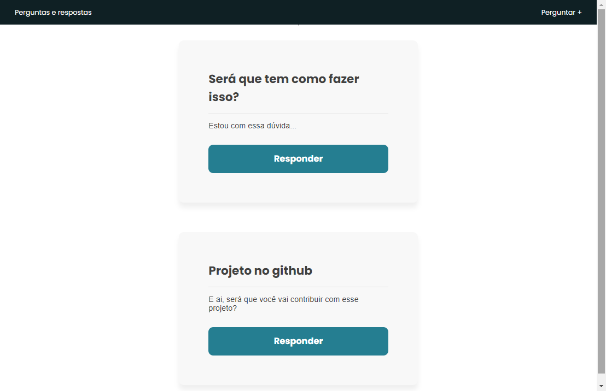
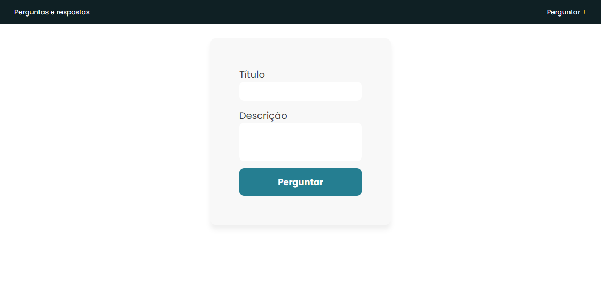
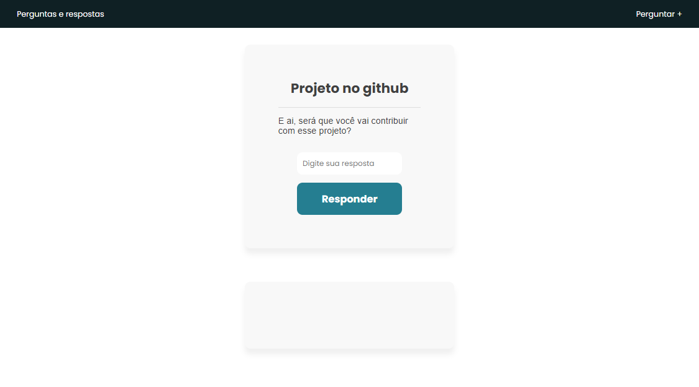

# Rede social de perguntas e respostas feito com node mysql





### Para rodar seu banco de dados é so acessar a pasta database e alterar no database.js a senha e nome do seu banco
- Não se esqueça de ter o banco de dados ativo para funcionar

### Use esses comandos para rodar seu projeto
```
  - npm install
  - npm start
```


### Autor
---
<a href="https://blog.rocketseat.com.br/author/thiago/">
 
 <sub><b>Joaby Oliveira</b></sub></a> <a href="https://blog.rocketseat.com.br/author/thiago//" title="Rocketseat">🚀</a>

Feito por mim, Joaby Oliveira </>

[](https://instagram.com/little_joaby) [](mailto:joabyoliveira2004@gmail.com)